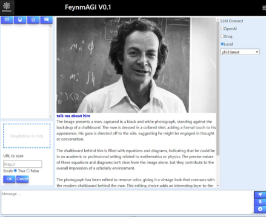

  
  <h1 align="center">Feynmagi V 0.1.31 </h1>

### Install ollama
- curl -fsSL https://ollama.com/install.sh | sh
- or go to : https://ollama.com/download

### Install feynmagi 
- pip install feynmagi 

### Or install from repo
- git clone https://github.com/Imag2020/feynmagi
- cd feynmagi
- pip install . 

### How to run
- feynmagi
- You can access it from any browser at localhost:5000

## 🌟 Feynmagi is a multi-modal tool for  MLLM interactive agents that integrates all the latest AI technologies into a single application, capable of running models locally on CPU or GPU (via Ollama). It incorporates proprietary code for embedding, RAG, and interactive AI, designed to model intelligent AIs with the goal of experimenting with AGI.
In this alpha test version 0.1.30, we add:
- Agents management with next agent call
- UI messages I/O display update with atatch button
  
In this alpha test version 0.1.30, we add:
- Agents management with live run and cron scheduler 
- swicth to gemma2 default local llm
- test tolls and fucntion calling with groq
- use of florence-2 for images
- send mail via smtp server (todo ==> use gmail OAuth)
- NB : mail config json under data dir, rename config_mail_to_do.json to config_mail.json
  
In this alpha test version 0.1.26, we have:
- Integration with OpenAI and Groq clients for external and faster inference, alongside local inference using Ollama.
- Chat capabilities with LLMs, images, documents, or AI agents.
- Ingestion of documents or web pages into a local vector database.
- Retrieval of past session histories.
- Support for new models in Ollama without code modification.
- use of florence-2 as vision model

The following agents are under development:
- Web search agent via Google 🌐
- Code interpreter agent ⚙️
- Memory agent 🧠

## ⚠️ Please note that this code is experimental and in the testing phase. It should not be tested on enterprise or confidential data. This code is shared for the AI community within an academic framework for scientific research, and the author does not authorize its use outside this scope without prior permission.

We welcome any contributions to the development towards this stated goal. 

### 

Visit us at [feynmagi.com](http://feynmagi.com) or email us at [imed@feynmagi.com](mailto:imed@feynmagi.com).

